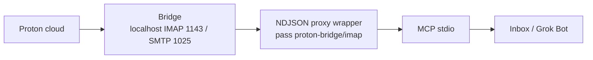
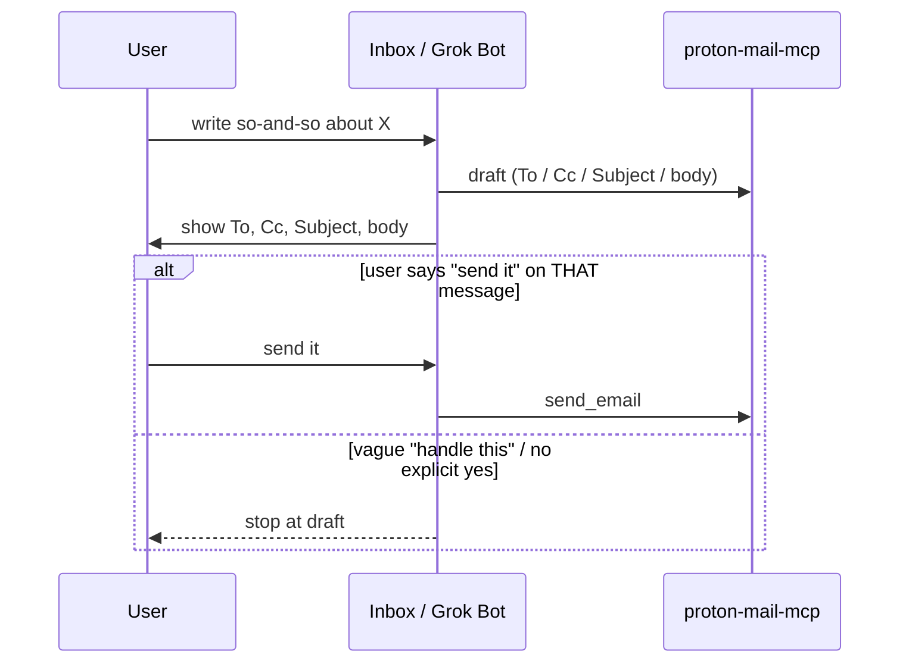
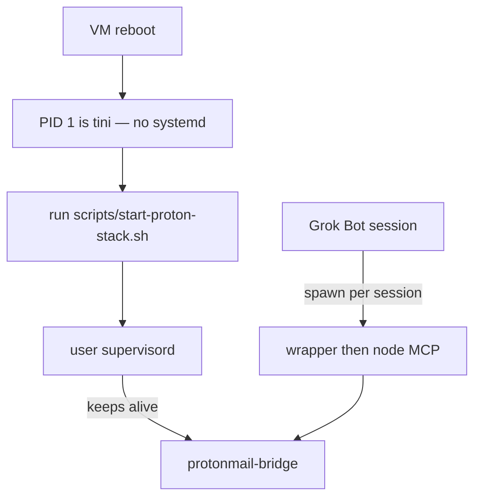

# Proton Mail MCP for Grok Bot

A public recovery base for talking to Proton Mail from Inbox / Grok Bot over
stdio. No secrets live here. Browser Proton burns quota; this is the cheap
local path: official Bridge on loopback, IMAP password in `pass`, MCP over
stdio.

Username comes from `PROTONMAIL_USERNAME`. Paths use `$HOME` (never a hardcoded
home directory). Replace `/home/YOU` in the supervisord example with your Unix
user.

## Why

Proton's web UI and unofficial HTTP scrapers chew through API quota and break
when the session dies. A paid Proton plan plus the official Linux Bridge gives
you IMAP `1143` and SMTP `1025` on localhost. Grok Bot then speaks MCP over
stdio through a tiny wrapper that pulls the IMAP password from `pass` at spawn
time. Cheap, local, recover-from-wipe.

## Architecture



Proton Mail Bridge holds the encrypted mailbox connection. The wrapper never
takes passwords on argv. It reads `pass proton-bridge/imap` (unless
`IMAP_PASSWORD` is already in the environment from a private store) and runs
an NDJSON JSON-RPC allowlist proxy in front of Node on the patched
`proton-mail-mcp` build. It does not `execv` onto Node; tools/list and
tools/call are filtered in the proxy even if the Node server is unpatched.

## Draft vs send

Drafts are autonomous. Sending is not. Vague "handle this" **stops at a draft**.



`send_email`, reply, and forward need an explicit yes on **that** message after
you have seen the headers and body. "Sure" about a different email does not
count.

## Process model

Grok Bot's PID 1 is `tini`. There is no systemd. User-level supervisord keeps
Bridge alive; MCP is spawned per session.



After a VM reboot, run `scripts/start-proton-stack.sh`. It will start
supervisord if the socket is gone, or just `supervisorctl start protonmail-bridge`
if supervisord is already up.

## What we patched and why

Upstream [`sethbang/proton-mail-mcp`](https://github.com/sethbang/proton-mail-mcp)
at `db671d9592f85b3b4f4ae6c32a27021258332abc` (v1.0.2) verifies TLS certificates
for SMTP and IMAP. Official Bridge on loopback uses a **self-signed** STARTTLS
cert. Without a skip, Node refuses `127.0.0.1`.

`patches/loopback-tls.patch` adds, in `EmailService` (host = `config.host`) and
`ImapService.createClient` (host = `this.config.host`):

```ts
const loopback = ["127.0.0.1", "localhost", "::1"].includes(host);
tls: loopback ? { rejectUnauthorized: false } : undefined,
```

TLS skip is **localhost-only**. Remote hosts still verify certificates.

That loopback skip is in `patches/loopback-tls.patch`. Live deployments then
layer `patches/harden.ts` (copy to `src/harden.ts`) plus `patches/harden.patch`:

- Optional cert pin: `PROTONMAIL_BRIDGE_CERT_SHA256` (64-char hex SHA-256 of the
  Bridge STARTTLS cert, colons allowed). Loopback still skips CA verify; the pin
  is extra. Omit the env var if you are not pinning.
- Send is **off** unless `PROTONMAIL_ALLOW_SEND=true` **and** the send-family
  tools are listed in `PROTONMAIL_ALLOWED_ACTIONS`. Missing or false is fail-closed.
- Mutating tools are limited by `PROTONMAIL_ALLOWED_ACTIONS` (comma list).
- Folder arguments and listings are limited by `PROTONMAIL_ALLOWED_FOLDERS`
  (comma list). Use `*` or `ALL` to disable the folder gate (wrapper default).
- The Python wrapper is an NDJSON JSON-RPC proxy (`scripts/proton-mail-mcp-wrapper.py`
  plus `scripts/proton_mail_mcp_policy.py`) so tools/list and tools/call stay
  gated even if the Node build is unpatched.

## Prerequisites

- Proton **paid** plan (Bridge is a paid feature)
- Linux (this stack is written for a Grok Bot VM)
- Node 24
- Python 3
- `pass` + GnuPG
- `supervisor` (user-level, not system)
- Official `protonmail-bridge` package from Proton — not a third-party binary

## Install

1. Clone **this** repo.
2. After clone, chmod +x scripts/*.sh scripts/*.py (the GitHub API cannot set executable bits).
3. Clone upstream sethbang/proton-mail-mcp and check out commit db671d9592f85b3b4f4ae6c32a27021258332abc (v1.0.2).
4. Copy patches/harden.ts into that checkout as src/harden.ts.
5. Apply patches/loopback-tls.patch, then apply patches/harden.patch (harden is incremental on top of loopback-tls).
6. Build the upstream MCP (Node 24): install dependencies and run the project build. Point MCP_JS at build/index.js (wrapper default: $HOME/.local/opt/proton-mail-mcp/build/index.js).
7. Install official Proton Mail Bridge from Proton.
8. Copy config/supervisord.conf.example to $HOME/.config/supervisor/supervisord.conf and replace YOU with your Unix user. Create $HOME/.local/var/run and $HOME/.local/var/log.
9. Set PROTONMAIL_USERNAME, then run scripts/proton-bridge-login.sh (this stops any supervised Bridge first so the lock is free).
10. After Bridge info, store the IMAP password with pass under the key proton-bridge/imap (pass insert -e). Never put it in git or MCP env files.
11. Start the stack with scripts/start-proton-stack.sh.
12. Register the MCP with Grok Bot (example below).

## Grok Bot AddMcpServer example

Command is Python, not Node. The wrapper injects the password from pass.
Never put the IMAP password in env or git.

```json
{
  "command": "/usr/bin/python3",
  "args": ["/path/to/proton-mail-mcp-grokbot/scripts/proton-mail-mcp-wrapper.py"],
  "env": {
    "READONLY": "false",
    "PROTONMAIL_USERNAME": "<set from PROTONMAIL_USERNAME>",
    "PROTONMAIL_ALLOW_SEND": "false",
    "PROTONMAIL_ALLOWED_ACTIONS": "save_draft,update_message_flags,mark_all_read,move_message,update_message_labels",
    "PROTONMAIL_ALLOWED_FOLDERS": "*",
    "IMAP_HOST": "127.0.0.1",
    "IMAP_PORT": "1143",
    "IMAP_SECURE": "false",
    "PROTONMAIL_HOST": "127.0.0.1",
    "PROTONMAIL_PORT": "1025",
    "PROTONMAIL_SECURE": "false",
    "ALLOW_EMPTY_FOLDER": "false",
    "ALLOW_FILE_DOWNLOAD_DIR": "$HOME/.local/share/proton-mcp-attachments"
  }
}
```

Wrapper defaults (override in env as needed):

- `PROTONMAIL_ALLOW_SEND` — must be `true` to register send/reply/forward. Default `false`.
- `PROTONMAIL_ALLOWED_ACTIONS` — comma list of mutating tools. Send-family tools also need `PROTONMAIL_ALLOW_SEND=true`.
- `PROTONMAIL_ALLOWED_FOLDERS` — comma list of IMAP folder paths. `*` or `ALL` disables the folder gate (default `*`). Tight example: `INBOX,Drafts,Sent,Starred,Archive,Trash,All Mail,Folders/Example`.
- `PROTONMAIL_BRIDGE_CERT_SHA256` — optional 64-char hex SHA-256 of the Bridge STARTTLS cert (colons allowed). Omit unless pinning.
- `NODE_BIN`, `MCP_JS` — paths; defaults are under `$HOME`.

Do not set `IMAP_PASSWORD` or `PROTONMAIL_PASSWORD` in this registration. Never put an IMAP password in git or MCP env.

## Persistence

- Bridge config and mailbox cache live under `$HOME` (Proton's own directories).
- Supervisord config: `$HOME/.config/supervisor/supervisord.conf`
- `pass` store: `$HOME/.password-store` (git-ignored here; keep it private)
- Attachment downloads: `$HOME/.local/share/proton-mcp-attachments`
- MCP build: `$HOME/.local/opt/proton-mail-mcp` (or wherever you set `MCP_JS`)

A Grok Bot VM wipe loses `$HOME`. This repo is the recipe to rebuild; it is not
a backup of `pass` or Bridge.

## Security

- IMAP password lives in `pass`, encrypted with your GPG key. The wrapper calls
  `pass proton-bridge/imap` at spawn. Nothing in this git tree decrypts it.
- On a **shared** Grok Bot machine, any process running as the same Unix user
  can decrypt that `pass` entry. Treat the box user as the trust boundary.
- Bridge listens on loopback only. There is no public IMAP/SMTP endpoint.
- TLS CA skip is gated to 127.0.0.1, localhost, and ::1. Do not widen that list.
- Optional pin: PROTONMAIL_BRIDGE_CERT_SHA256. When set, the Bridge cert must match.
- Send is off unless PROTONMAIL_ALLOW_SEND=true and the send tools are on PROTONMAIL_ALLOWED_ACTIONS.
- Never commit `.env`, `*.pem`, `.password-store`, or `secrets/`.

## Read vs write

| Action | When Grok Bot may do it |
| --- | --- |
| List / search / read mail | Yes, as needed |
| Save a draft | Yes, autonomous |
| send_email / reply / forward | Only if PROTONMAIL_ALLOW_SEND=true, the tool is on PROTONMAIL_ALLOWED_ACTIONS, and you said yes on **that** message |

A vague "handle this" stops at draft.

## Recovery after VM wipe

1. Restore or recreate your GPG key so `pass` works, or log into Bridge again.
2. Clone this repo and upstream at `db671d9`, copy src/harden.ts, apply loopback-tls then harden patches, then install Node deps and build.
3. Install official `protonmail-bridge` and `supervisor`.
4. Drop in supervisord config from the example (`/home/YOU` to your user).
5. Export `PROTONMAIL_USERNAME`, then run `scripts/proton-bridge-login.sh` if the Bridge keychain is gone.
6. Re-insert `pass` key `proton-bridge/imap` if the store was wiped.
7. Run `scripts/start-proton-stack.sh`.
8. Re-register the MCP. Still no IMAP password in env.

## Attribution

Scripts and docs in this repo: MIT, Copyright 2026 Elder Lira.

MCP server code is [`sethbang/proton-mail-mcp`](https://github.com/sethbang/proton-mail-mcp)
at commit `db671d9592f85b3b4f4ae6c32a27021258332abc` (v1.0.2), also MIT. This
project is **not affiliated with Proton AG**.
